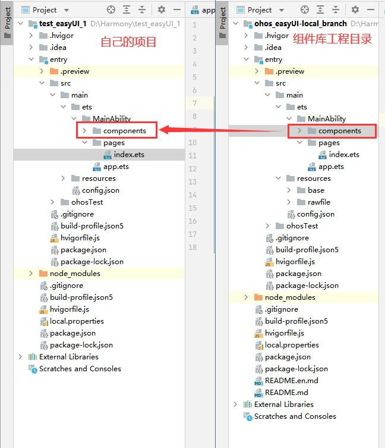
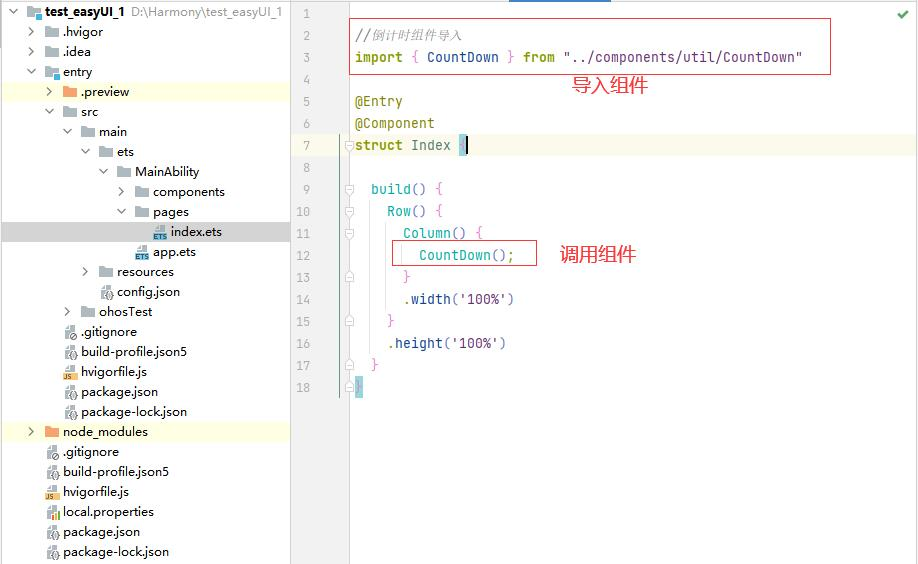
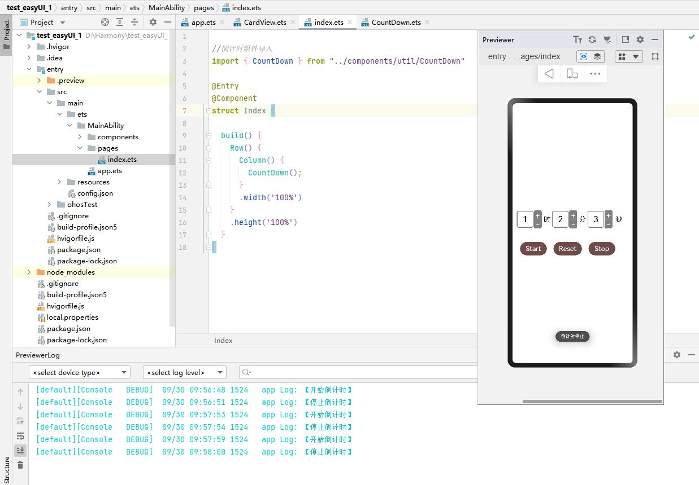

# ohos_easyUI

#### 介绍
​        ohos_easyUI是一套基于OpenHarmony  ArkUI深度定制的组件框架，包含JS、eTS两套语言的组件实现，每一套包含模板布局、图形图像、动画效果、表单表格、日期显示、菜单显示、文本处理等多类组件实现，适用大部分 OpenHarmony 应用的开发 ，能够更加完善OpenHarmony 的应用开发能力，使我们的应用开发更简单。

#### 工程目录
* 组件文件目录

~~~
└─src
    ├─main
    │  │  config.json
    │  │
    │  ├─ets   
    │  │  └─MainAbility
    │  │      │  app.ets
    │  │      │
    │  │      ├─components   //组件文件夹
    │  │      │  ├─beans     //公共类文件夹
    │  │      │  │      ImageItem.ets
    │  │      │  │
    │  │      │  ├─table     //表格类组件
    │  │      │  │      CustomCalendar.ets
    │  │      │  │
    │  │      │  ├─ui        //UI类组件
    │  │      │  │  │  CardView.ets
    │  │      │  │  │  ImageButton.ets
    │  │      │  │  │  ImageCrop.ets
    │  │      │  │  │  ImageCurtain.ets
    │  │      │  │  │  ImageSwiper.ets
    │  │      │  │  │  ImageZoom.ets
    │  │      │  │  │  LabelView.ets
    │  │      │  │  │  MaskGuideView.ets
    │  │      │  │  │  SearchView.ets
    │  │      │  │  │
    │  │      │  │  └─SwipeCaptcha
    │  │      │  │          rotatePuzzle.ets
    │  │      │  │          simpleSwipe.ets
    │  │      │  │          swipePuzzle.ets
    │  │      │  │
    │  │      │  └─util      //工具类组件  
    │  │      │          CountDown.ets
    │  │      │
    │  │      └─pages
    │  │              index.ets
~~~

- 资源文件目录

~~~
    │  │
    │  └─resources    //资源文件夹
    │      ├─base
    │      │  ├─element
    │      │  │      color.json
    │      │  │      string.json
    │      │  │
    │      │  └─media
    │      │          bg_tv.jpg
    │      │          icon.png
    │      │          refreshicon.png
    │      │          swipeicon.png
    │      │
    │      └─rawfile
    │              CardView_test1.png
    │              ImageButton_test1.png
    │              ImageCrop_dog.jpg
    │              ImageCurtain_sniper.png
    │              ImageCurtain_test1.jpg
    │              ImageSwiper_test1.jpg
    │              ImageSwiper_test2.jpg
    │              ImageSwiper_test3.jpg
    │              ImageZoom_dog.jpg
    │              Loading_loading1.json
    │              Loading_loading2.json
    │              Loading_loading3.json
    │              Loading_loading4.json
    │              Loading_loading5.json
    │              SearchView_search.png
    │              SwipeCaptcha_test1.jpg
    │              SwipeCaptcha_test2.jpg
    │              SwipeCaptcha_test3.jpg
    │              SwipeCaptcha_test4.jpg
    │              SwipeCaptcha_test5.jpg
    │              SwipeCaptcha_test6.jpg
    │              SwipeCaptcha_test7.jpg
    │              SwipeCaptcha_test8.jpg
~~~

#### 组件支持

- CardView:卡片视图组件，以简洁美观的卡片视图来展示用户的信息。
- CustomCalendar:自定义日历组件，重构日历的外观实现，以对话框的形式对日期进行选择。
- CountDown:倒计时组件，该组件可以任意设定时分秒，以美观的方式展示设置的倒计时。
- ImageButton:图片按钮组件，该组件可丰富按钮的样式以及美化按钮组件的展示效果，通过添加图片即可让该图片以按钮的样式展示。
- ImageCrop:图片剪切组件，添加图片到该组件上，即可实现图片的自由剪切效果。
- ImageCurtain:图片窗帘组件，添加图片后，通过拖拽可以让图片以窗帘的效果开合缩放。
- ImageSwiper:图片轮播组件，添加想要轮播的图片，便可展示出轮播效果，可设置轮播速度的快慢，左右滑动查看图片。
- ImageZoom:图片放缩旋转组件，添加图片后，可以对图片进行放缩和旋转。
- LabelView:标签组件，将图片或者其他媒体文件打上标签，直观展示图片的关键核心信息。
- MaskGuideView:蒙版引导组件，通过添加蒙版组件，可以高亮显示所要展示的内容，引导用户进行操作使用。
- SearchView:搜索组件，以动态的方式丰富搜索框的样式。
- rotatePuzzle:旋转拼图验证组件，旋转拼图实现验证效果。
- simpleSwipe:滑动验证组件，拖动滑动条实现验证效果。
- swipePuzzle:拼图验证组件，拖动拼图块实现验证效果。

#### 组件运行环境
- SDK版本：API 9（向下兼容至API 8）
- 开发环境：DevEco Studio 3.1 Beta1

#### 安装教程

1. 引入组件库

   打开项目工程目录，找到entry\src\main\ets\MainAbility\components文件夹，右键选择复制，粘贴到自己项目的entry\src\main\ets\MainAbility目录下即可；

   

2. 在需要调用组件的.ets文件中导入组件，并调用该组件即可（下图以倒计时组件为例）；

   

3. 组件效果演示；

   

#### 使用说明

1.  与图片相关的组件，在调用前需准备好图片资源文件，并将该资源放在entry\src\main\resources\rawfile文件夹下，也可以复制组件库中用于演示组件效果的相关图片资源文件到自己的工程对应的资源目录下；
1.  如对组件库中的组件有更高程度自定义需求，可以对组件源代码进行相应修改；

#### 参与贡献

1.  Fork 本仓库
2.  新建 Feat_xxx 分支
3.  提交代码
4.  新建 Pull Request

6.  https://gitee.com/gitee-stars/)

#### 联系人

zhuwei@iscas.ac.cn